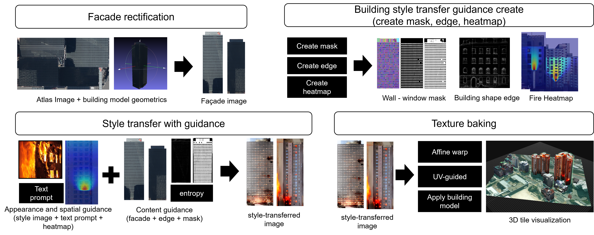

# Heatmap-Guided Fire Appearance Stylization of Building Facade Textures

**"Heatmap-Guided Fire Appearance Stylization of Building Facade Textures for Urban Digital Twins"**

This repository provides a demo implementation for applying spatially controlled fire appearance stylization to textured 3D building models while preserving the original geometry, UV coordinates, and facade structure.

## Overview

<p align="center">
  
</p>

The pipeline converts atlas textures into facade-aligned images, generates structure and heatmap guidance, performs diffusion-based fire appearance stylization, and reconstructs the results into the original texture atlas.

## Tested environment:
- Ubuntu 22.04
- NVIDIA RTX 4090 24 GB
- Python 3.10
- PyTorch 2.6.0 + CUDA 12.4

## Installation

```bash
git clone https://github.com/IngIeoAndSpare/3D-Building-Heatmap-Guide-for-Specifying-Fire-Styles.git
cd 3D-Building-Heatmap-Guide-for-Specifying-Fire-Styles

python3 -m venv venv
source venv/bin/activate

pip install --upgrade pip

pip install torch==2.6.0 torchvision==0.21.0 \
    --index-url https://download.pytorch.org/whl/cu124

bash scripts/setup_engine.sh
pip install -r requirements.txt -c constraints.txt
```

The setup script installs the ComfyUI-based inference engine and the required
external components used by the demo.

## Model Weights

The following pretrained model weights are required.

| Component | Source | Destination under `engine/ComfyUI/` |
|---|---|---|
| Juggernaut XL XI | [Civitai](https://civitai.com/api/download/models/782002) | `models/checkpoints/juggernautXL_juggXIByRundiffusion.safetensors` |
| T2I-Adapter LineArt SDXL | [Hugging Face](https://huggingface.co/TencentARC/t2i-adapter-lineart-sdxl-1.0) | `models/controlnet/t2i-adapter-lineart-sdxl-1.0.fp16.safetensors` |
| IP-Adapter Plus SDXL | [Hugging Face](https://huggingface.co/h94/IP-Adapter) | `models/ipadapter/ip-adapter-plus_sdxl_vit-h.safetensors` |
| CLIP Vision ViT-H/14 | [Hugging Face](https://huggingface.co/h94/IP-Adapter) | `models/clip_vision/CLIP-ViT-H-14-laion2B-s32B-b79K.safetensors` |
| LineArt Annotator | [Hugging Face](https://huggingface.co/lllyasviel/Annotators) | `custom_nodes/comfyui_controlnet_aux/ckpts/lllyasviel/Annotators/` |
| SAM 2.1 Hiera-Small | [Hugging Face](https://huggingface.co/facebook/sam2.1-hiera-small) | `models/sam2/sam2.1_hiera_small.pt` |

The required model files can be downloaded automatically:

```bash
python scripts/download_models.py
```

The downloaded files can be verified using:

```bash
python scripts/download_models.py --check
```

The pretrained model weights are not redistributed as part of this repository
and remain subject to their original licenses and terms of use.

## Run the Demo

```bash
python demo.py
```

The demo interface is available at:

```text
http://127.0.0.1:7860
```

Upload a textured 3D building model and run the stylization pipeline.

## Input Format

The current implementation supports textured OBJ building models.

```text
building.obj        Required
texture.png         Required
building.mtl        Optional
```

Multiple texture images are also supported when referenced by the material file.